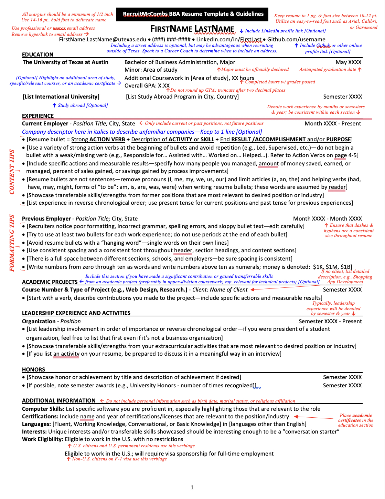

<aside>
📌 A resume serves as a professional summary of your educational background, professional experiences, and skills, tailored specifically for the internship or job role you're targeting. The main goal of your resume is to secure an interview. It's important to remember that resumes aren't one-size-fits-all; while this notion offers tips and guidelines, your resume should effectively represent your unique personal brand and tailored to your industry.

</aside>

_Read through all sections before starting to reduce having to go back and forth to fix issues addressed later on in the Notion_

## Get Started

[ResumeTemplate.docx](ResumeTemplate.docx)

If you do not have word check if your high school offers educational word access. If not you can use the free 30 day free trial.

### 1. Contact Information

- Name in larger font (easy to read, bold)
- City, State
- Phone Number
- Email Address (make sure it is professional: ex: ✅ rjackson@gmail.com ❌ jackbatman578@gmail.com)

### 2. Education

- School Name
- Major or Concentration
- Expected Graduation Date
- GPA if above 3.0
- Higher Level Course Work

### 3. Experience

- List all paid an unpaid experiences
  - Job Titile
  - Company
  - Location
  - Employment Date (ex: Jan 2022 → December 2022)

### 4. Leadership + Activities

- List leadership positions held
- List involvement in activities, organizations, volunteer experience

### 5. Projects

_Not everyone has projects, but if you do it can be a unique supplement toy our application. **Signature Projects** are perfect to highlight on this portion of the resume_

- List projects
- Describe Skills (ex: research, lab skills, programming languages, tools)

## Mastering Resume Writing

